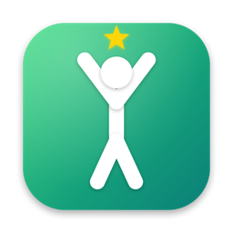
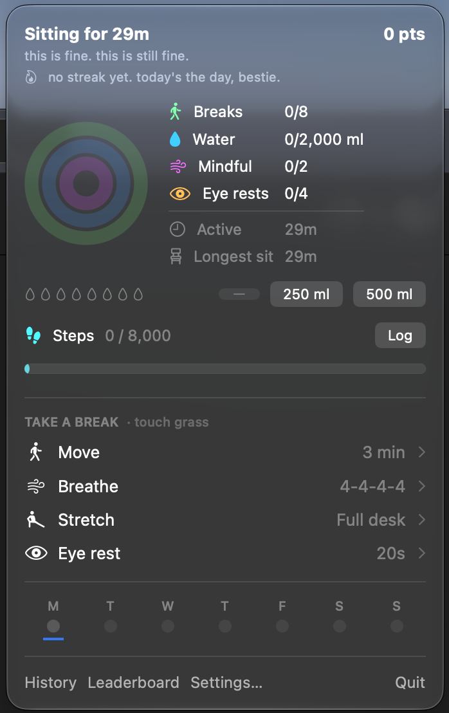
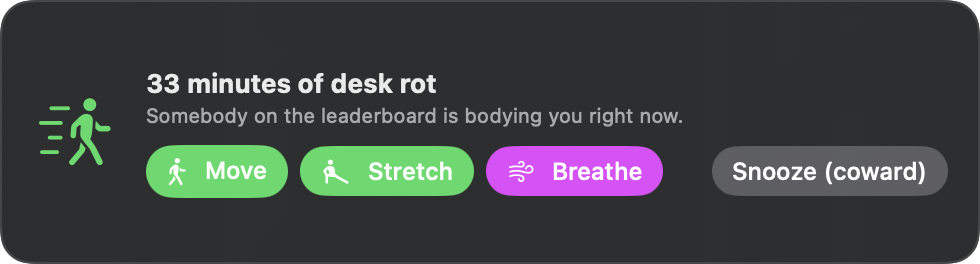
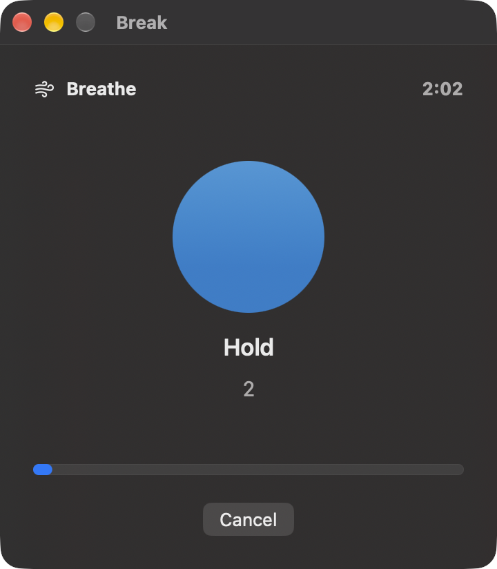
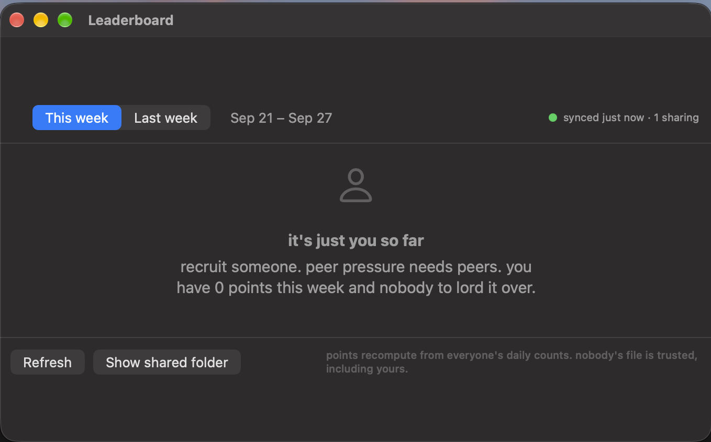
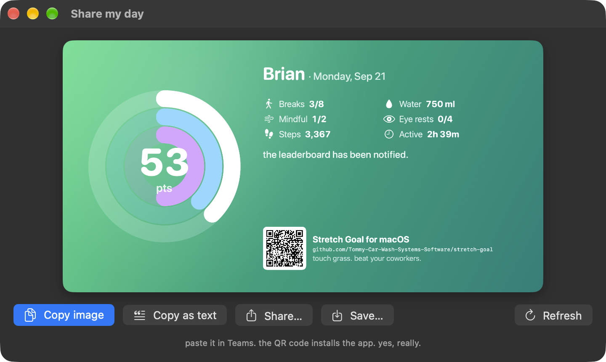
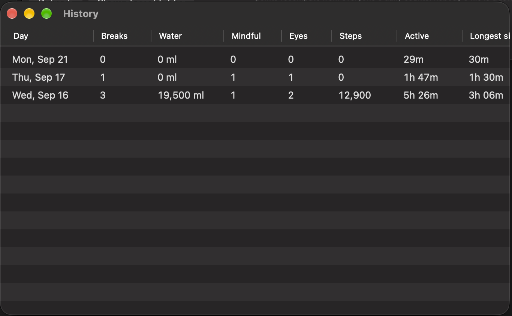
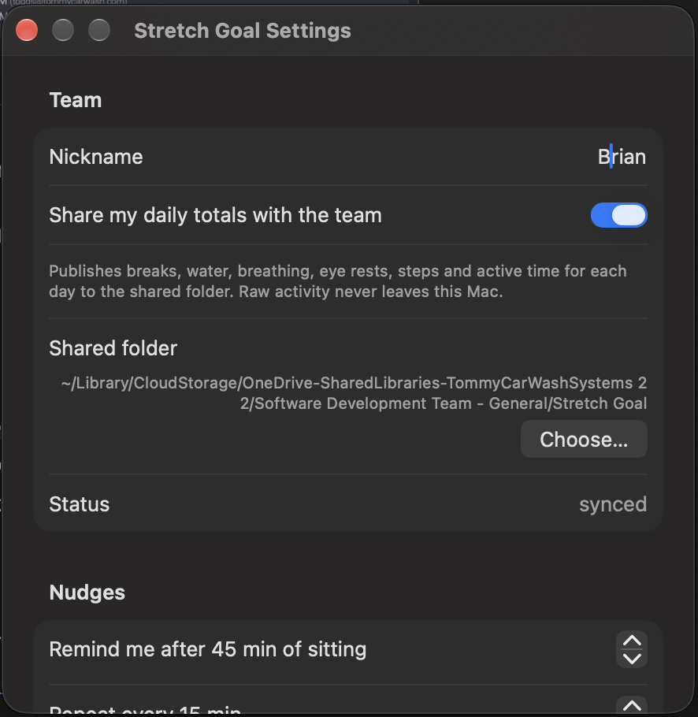
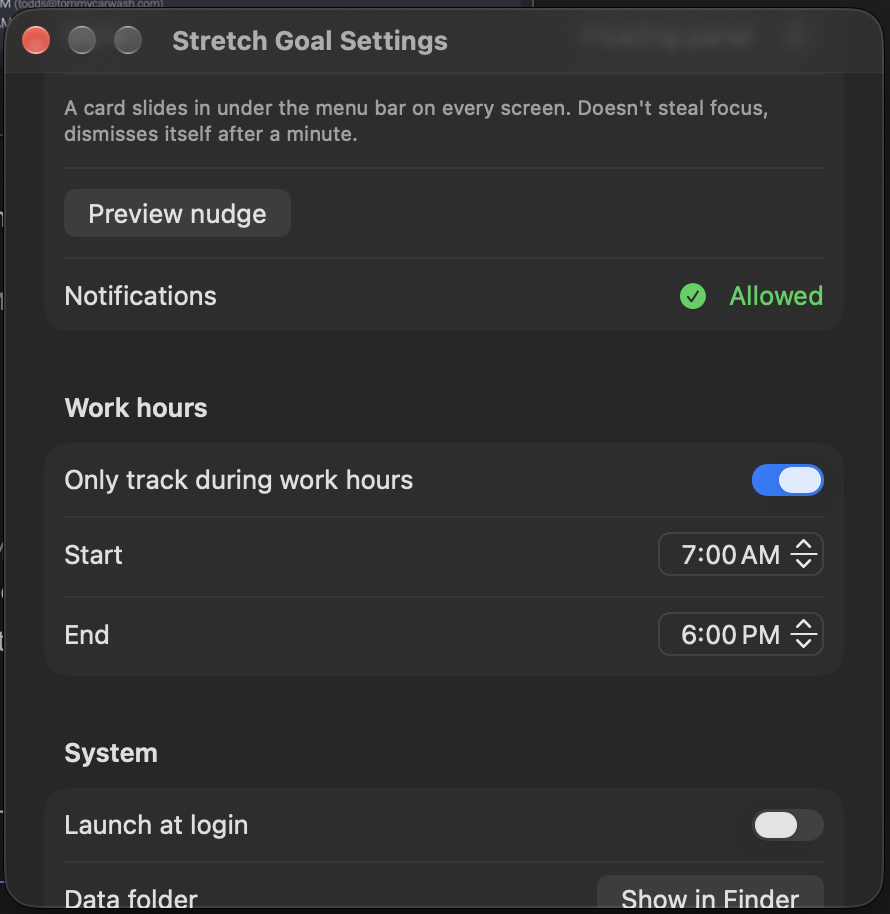

<p align="center">
  
</p>

<h1 align="center">Stretch Goal</h1>

<p align="center">
  a menu bar app that makes taking care of yourself at your desk a competition,<br>
  because peer pressure ate and left no crumbs 💅
</p>

<p align="center">
  <b>macOS 26 or 27</b> · Swift · no server · syncs through the OneDrive library you already have
</p>

---

We are excellent at closing tickets and terrible at standing up. Stretch Goal sits in your menu
bar, notices how long you've been in the chair, nags you (kindly, then less kindly), walks you
through actual breaks, tracks your water and steps, scores your day, and ranks you against the
team every week. Everything below is real and shipping. `brew upgrade` is your friend.

## Install

```bash
brew tap tommy-car-wash-systems-software/tap
brew trust tommy-car-wash-systems-software/tap
brew install --cask stretch-goal
```

`brew trust` is a one-time thing recent Homebrew wants for third-party taps. Later updates are
just `brew upgrade`. No Homebrew? Grab the zip from the [latest release](../../releases/latest)
and drag **Stretch Goal.app** into `/Applications`.

**First launch, either way:** the app is signed but not notarized (nobody paid Apple $99 for a
side project), so macOS says it "could not verify Stretch Goal is free of malware." Click
**Done**, open **System Settings → Privacy & Security**, scroll down, click **Open Anyway**.
One time only. Or, if Terminal is more your speed:

```bash
xattr -dr com.apple.quarantine "/Applications/Stretch Goal.app" && open "/Applications/Stretch Goal.app"
```

Then look for the walking figure in your menu bar. Turn on **Launch at login** in Settings so it
never leaves. It is a menu bar app: no Dock icon, no windows until you ask for one.

## The tour

### The popover



Click the walking figure. Everything you need is right here.

- **Sitting timer.** How long you've been in the chair without a real break. Under it, a line
  of commentary that escalates from *"this is fine. this is still fine."* to *"the chair has
  legally adopted you."* It is not wrong.
- **Points and streak.** Today's score, top right. Hover it for the exact arithmetic. The flame
  is your streak of perfect weekdays.
- **Rings.** Breaks, water, mindful. Close all three and you get the bonus.
- **Goals.** Breaks out of 8, water out of 2,000 ml, breathing sessions out of 2, eye rests out
  of 4. Plus active time and your longest sit, because you should know.
- **Water.** Eight drops, one per 250 ml glass. Tap **250 ml** for a glass or **500 ml** for a
  bottle; the bottle fills two drops. The minus undoes. It stops at 2 litres, because that's the
  recommendation and more isn't healthier.
- **Steps.** Log today's total off your phone or watch with **Log**, or **+500** / **+1k** when
  you actually went for a walk.
- **Take a break.** The four guided sessions. More below.
- **Week strip.** Monday to Sunday. Green dot for a perfect day.

<br clear="right">

### Nudges



Sit for 45 minutes (adjustable) and a card slides in under the menu bar on every screen. It
floats above whatever you're doing but never steals your keyboard, so it can't eat your typing.
One click starts a break. It gives up after a minute and comes back in 15 if you're still sitting.
The Snooze button is sometimes labeled *(coward)*. We stand by this.

Not enough? Settings has a **full-screen** style that dims every display until you pick a break
or snooze. For the truly desk-rotted. There's also plain system notifications if you want to be
ignored efficiently.

### Guided breaks



Only finished sessions count, and the app watches your keyboard and mouse the whole time. Keep
typing during a walk and it fails with no credit and a message like *"you're still typing.
that's not a walk."*

- **Move · 3 min.** Walk away from the desk. Touch grass, literally. Counts as a break and
  resets the sitting timer.
- **Stretch · Full desk.** Eight 30-second stretches: neck, shoulders, wrists, seated twist,
  chest, hamstrings, calves, reach up. Counts as a break.
- **Breathe · 4-4-4-4.** Box breathing for two minutes. The orb grows on inhale, holds, shrinks
  on exhale, holds. Counts as mindful.
- **Eye rest · 20 s.** Look at something 20 feet away. The Jira board doesn't count. Counts as
  an eye rest, per the 20-20-20 rule.

Sessions run in their own little window so they survive you clicking elsewhere. Nudge cards and
notifications open them directly.

<br clear="right">

### Leaderboard



**Leaderboard** in the popover footer. Ranks the team for this week (or last week) by points,
with streak, perfect days, steps, and a checkmark for anyone who already closed their rings
today. Crown on first place. Your row is bold and says *you*, in case you forgot.

To get on the board: **Settings → Team**, pick a nickname, flip **Share my daily totals**. Until
someone else does the same you'll see the screen above, and it's right: recruit someone.

### Share your day



**Share** in the popover footer renders a card: your rings, points, streak, the day's numbers, a
line of commentary, and a QR code that points at this repo so whoever sees it can install the
app. **Copy image** puts it on the clipboard for Teams. **Copy as text** gives you a one-liner
for chat. **Share…** opens the system share sheet, **Save…** writes a PNG. Post a perfect day.
Make it everyone's problem.

### History



Your last 30 days in a table. Breaks, water, mindful, eyes, steps, active time, longest sit,
points, and a seal for perfect days. Yes, someone logged 19.5 litres of water on the 16th during
testing. That's why there's a cap now.

### Settings

<p>
  
  
</p>

- **Team.** Nickname, the sharing toggle, where the shared folder was found, and sync status.
  The folder auto-detects inside your OneDrive library; **Choose…** is there if your Mac is weird.
- **Nudges.** When the first nudge fires, how often it repeats, which style (floating card,
  full screen, or system banner), and a **Preview nudge** button so you don't have to wait 45
  minutes to see it.
- **Work hours.** Only track sitting between two times. Default 7 to 6. Turn it off if you want
  the app judging you on Saturday.
- **System.** Launch at login (only from the installed copy, so a dev build never becomes your
  login item), and a shortcut to your data folder.

## Scoring

| Action | Points | Daily goal | Daily cap |
|---|---|---|---|
| Break: 20+ min sit ended by 3+ min away, or a finished Move/Stretch | 10 | 8 | 12 |
| Water, per 250 ml glass | 3 | 2,000 ml | 2,000 ml |
| Mindful: a finished Breathe | 8 | 2 | 4 |
| Eye rest: a finished 20 s | 2 | 4 | 12 |
| Steps, per 1,000 | 2 | 8,000 | 15,000 |
| Breaks + water + mindful goals all hit | +25 | | |

Streak multiplier: +5% per consecutive perfect weekday *carried into* today, max +50%. Day one
of a run is 1.0×, day two 1.05×, and so on. Weekends neither help nor hurt. Steps and eye rests
score but never gate the bonus, so nobody's locked out for not owning a step counter.

Maximum possible day: 382. If you hit it, screenshot it.

### Where the numbers come from

This is a health app, so the targets follow commonly cited guidance rather than vibes:

- **Breaks, 8/day.** Sedentary-time guidance says break up sitting every 30 to 60 minutes.
  Hourly over an 8-hour workday is 8. A break only counts after 20+ minutes seated and 3+
  minutes away, so idle flapping can't farm it.
- **Water, 2,000 ml.** The "eight 8-oz glasses" heuristic, inside the 2.0 to 2.5 L/day from
  beverages that EFSA and the US Institute of Medicine describe as adequate for adults. Coffee
  and tea count. Logging stops at 2 L because more is not a health target.
- **Breathing, 2 × 2 min.** A few minutes of daily breathwork shows measurable stress effects in
  controlled studies; box breathing at 4-4-4-4 is the simplest version.
- **Eye rests, 4/day.** Optometry's 20-20-20 rule. Every 20 minutes all day would be ~24; four
  is the floor we celebrate.
- **Steps, 8,000.** A 2022 meta-analysis of 15 cohorts found mortality benefit plateauing around
  8,000 to 10,000 steps for adults under 60.

Better sources? Open an issue. The rules live in one struct, `ScoringRules`.

## Nobody cheats

It's a competition, so every input has a guard:

- **Water** stops at 2 L and refuses more than 750 ml in any 30 minutes. Nobody drinks two
  litres in a minute.
- **Guided breaks** fail on real input: 15 s tolerated for Move, 30 for Stretch, 15 for Breathe,
  5 for Eye rest, with a 3 s grace at the start so you can lock the screen. Display sleep, wake,
  and the lock screen don't count as input. (They did once. It was a whole thing.)
- **Detected breaks** need a 20-minute sit ended by 3+ minutes away, and a finished Move or
  Stretch consumes the current sit so it can't be credited twice.
- **Steps** are honor-system by nature (no HealthKit on a Mac), but clamp at 30,000 and only
  15,000 score. Nobody walked 15 miles on a Tuesday.
- **Points** are recomputed from raw counts by every reader, never trusted from a file, and
  every count is capped. Hover the points total for the receipts.

## How the sync works

No server. Each person's app writes only its own files into the shared folder:

```
Software Development Team - General/Stretch Goal/
  README.md
  members/
    <you>/
      profile.json                    ← nickname
      daily/2026-09-21.<device>.json  ← today's totals, one file per Mac
```

Because nobody ever writes anyone else's file, two people can't overwrite each other and
OneDrive never has a conflict to resolve. Everyone's app reads all the files for this week and
last, merges multiple Macs per person by taking the max of each count, and recomputes points
locally with the same rules. A file that hasn't downloaded yet, is malformed, or claims to be
someone else's is skipped, not trusted. Reads have a 3-second deadline so a stuck File Provider
can't hang the app. Refresh is every 60 seconds plus whenever you open the leaderboard. If
OneDrive is offline you see the last good board with the sync time on it.

## Privacy

Everything is stored locally in `~/Library/Application Support/Stretch Goal/`. Sharing is off
until you turn it on. When you do, only one small file per day leaves your Mac: breaks, water,
breathing, eye rests, steps, active seconds, longest sit. No timestamps of when you were or
weren't at the keyboard, ever. You pick the name shown. Turn sharing off and publishing stops.

## The voice

Status lines, nudges, and celebrations rotate through a pool of lines in the register of
[issue #1](../../issues/1), where Amanda asked for step tracking as a persuasive essay and set
the tone for the whole app. Functional labels stay plain so nobody needs a translator to use a
Settings pane; the flavor lives in secondary text. Every line is in one file,
[`Quips.swift`](Packages/StretchGoalCore/Sources/StretchGoalCore/Quips.swift). Adding one is
the easiest PR in this repo. Keep it workplace-safe. Keep it unhinged.

Milestones come with unit conversions: desk-to-Keurig runs (40 steps), laps of the wash tunnel
(110), trips to the far bathroom you never use (260), parking-lot crossings when you parked far
to feel something (700), and actual miles (2,100). 10,000 steps is 250 Keurig runs. The Keurig
fears you.

## Development

```bash
brew install xcodegen
xcodegen generate
open StretchGoal.xcodeproj
```

Core logic (scoring, streaks, the tracker state machine, sync layout) is a pure Swift package
with no AppKit so it can be reused on iOS and watchOS later:

```bash
cd Packages/StretchGoalCore && swift test
```

Cut a release with `scripts/release.sh` (needs a checkout of the tap at `../homebrew-tap`). The
icon is generated, not drawn: `swift scripts/make-icon.swift out.png`. Design notes and the sync
protocol are in [docs/SPEC.md](docs/SPEC.md).

URL scheme for scripts and notifications: `stretchgoal://session/<move|breathe|stretch|eyeRest>`
and `stretchgoal://leaderboard`.

## Roadmap

1. ~~Local tracker~~
2. ~~Team leaderboard via the shared OneDrive library~~
3. If it takes off: proper backend, iOS and watch apps on the same core package (and HealthKit
   step sync for the chronically optimized), Windows and Android clients writing the same daily
   file.

## Why

We are good at closing tickets and bad at standing up. Built by Brian Phillips as a side project
for the software team. Suggestions, PRs, and new quips welcome. Desk rot: cancelled.
